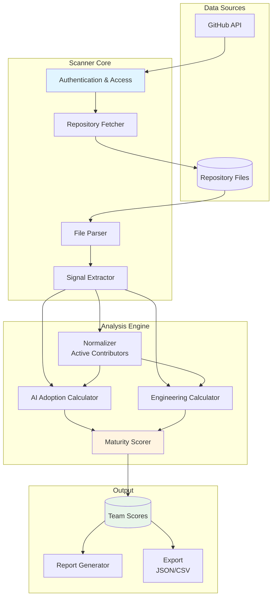
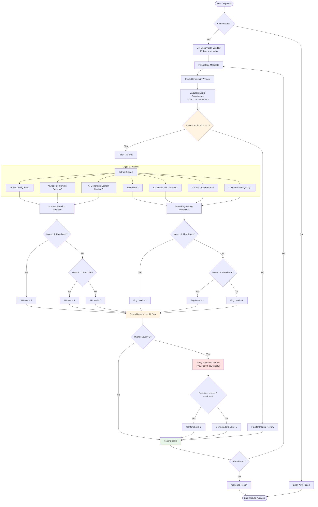
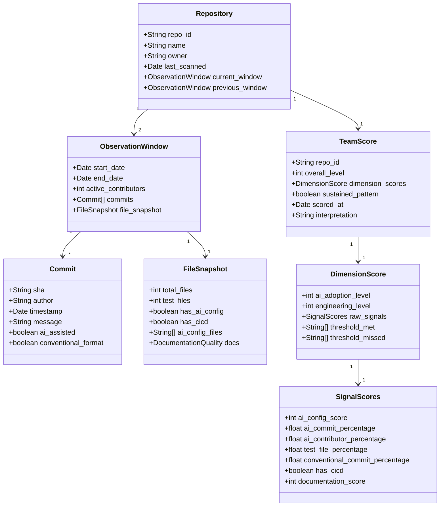

# Architecture: AI-Native Team Scanner

This document describes the system architecture for detecting AI-native teams through GitHub repository analysis.

## High-Level System Architecture



**Key Components:**

- **Authentication & Access**: Handles GitHub API authentication (token/app), manages rate limits, validates access permissions
- **Repository Fetcher**: Retrieves repo metadata, commit history, file tree for the observation window (90 days)
- **File Parser**: Reads file contents, identifies file types, extracts commit messages and metadata
- **Signal Extractor**: Detects AI tool configs, conventional commits, test files, CI/CD configs, documentation
- **Normalizer**: Calculates active contributors (distinct commit authors in window) for metric normalization
- **AI Adoption Calculator**: Scores AI signals against Level 1/2 thresholds
- **Engineering Calculator**: Scores engineering practice signals against Level 1/2 thresholds
- **Maturity Scorer**: Applies "lower of two" rule to determine overall team level
- **Report Generator**: Creates human-readable summaries of findings
- **Export**: Outputs structured data (JSON/CSV) for further analysis or dashboards

---

## Scanning and Scoring Flow



**Key Decision Points:**

1. **Active Contributors Check**: Repos with <2 contributors flagged for manual review (may be maintenance mode or data quality issue)
2. **Threshold Evaluation**: Each dimension scored independently against L1 and L2 criteria
3. **Lower-of-Two Rule**: Team can't be L2 overall unless BOTH dimensions are L2
4. **Sustained Pattern Verification**: L2 candidates must show excellence across two consecutive 90-day windows

---

## Data Model

### Core Data Structures



### Signal Thresholds (Configuration)

These values should be configurable per organization:

```yaml
thresholds:
  ai_adoption:
    level_1:
      ai_config_present: true
      ai_commit_percentage: 20
      signal_categories_met: 2
    level_2:
      ai_config_sophisticated: true
      ai_commit_percentage: 60
      ai_contributor_percentage: 80
      sustained_windows: 2
  
  engineering:
    level_1:
      test_file_percentage: 15
      conventional_commit_percentage: 30
      cicd_present: true
      documentation_present: true
    level_2:
      test_file_percentage: 25
      conventional_commit_percentage: 70
      cicd_comprehensive: true
      documentation_quality: high
      sustained_windows: 2

normalization:
  observation_window_days: 90
  minimum_active_contributors: 2
  
scoring:
  rule: "min"  # Overall level = min(ai_level, eng_level)
```

---

## Implementation Phases

### Phase 1: Core Scanner (MVP)
**Goal**: Scan a single repo, output basic scores

- GitHub API authentication
- Fetch commits and files for 90-day window
- Calculate active contributors
- Detect basic signals (config files, test files, commit patterns)
- Score against L1 thresholds
- Output JSON with scores

**Deliverable**: Command-line tool that scans one repo at a time

### Phase 2: Batch Processing
**Goal**: Scan multiple repos efficiently

- Batch API calls
- Rate limit handling
- Parallel processing
- Progress tracking
- Results aggregation

**Deliverable**: Scan 100+ repos in reasonable time

### Phase 3: Sustained Pattern Detection
**Goal**: Implement L2 verification

- Store historical scans
- Compare current vs previous windows
- Verify sustained excellence
- Track trends over time

**Deliverable**: Full L0/L1/L2 maturity scoring

### Phase 4: Reporting & Integration
**Goal**: Make results actionable

- Generate human-readable reports
- Export to CSV/JSON for analysis
- Dashboard integration (optional)
- Scheduled scanning (optional)

**Deliverable**: Results ready for leadership consumption

---

## Deployment Options

### Option A: Local Script
- Run on developer machine
- Manual execution
- Good for: Initial testing, ad-hoc scans

### Option B: GitHub Action
- Runs on schedule in GitHub
- Automatic scanning
- Results committed to repo
- Good for: Regular updates, self-service

### Option C: Standalone Service
- Dedicated server/container
- API endpoint for queries
- Database for historical data
- Good for: Enterprise scale, integration with other systems

### Option D: Serverless Function
- AWS Lambda / Cloud Functions
- Triggered on schedule
- Results to S3/Cloud Storage
- Good for: Cost efficiency, scalability

**Recommendation for MVP**: Start with **Option A** (local script), then graduate to **Option B** (GitHub Action) for automation.

---

## Technology Stack

**Language:** Python
- Rich GitHub API libraries (PyGithub)
- Excellent data analysis tools (pandas)
- Easy to iterate and prototype
- Wide library ecosystem

**Key Libraries:**
- **PyGithub** - GitHub API client
- **pandas** - Data processing and analysis
- **json** - Configuration and output format
- **datetime** - Window calculations
- **argparse** - CLI interface

**Configuration Format:** JSON
- Thresholds and settings in JSON files
- Easy to read and modify
- Native Python support
- Output format matches config format

**Storage:**
- JSON files for results (simple, portable)
- File system for historical scans
- No database required for MVP

**Authentication:**
- GitHub Personal Access Token via environment variable
- Stored in `.env` file (not committed)
- Token needs `repo` scope for private repos

---

## Open Questions

1. **Where should threshold configurations live?** (JSON file in repo root, separate config directory?)
2. **What's the target scan frequency?** (Weekly, monthly, on-demand?)
3. **Who runs this initially?** (You manually, automated later?)
4. **Where do final results go?** (JSON files in results/ directory, also generate markdown reports?)
5. **How do we handle private repos at scale?** (Personal token sufficient, or need GitHub App?)
6. **Should we cache GitHub API responses?** (Avoid re-fetching unchanged data, how long to cache?)
7. **Repo list input format?** (JSON file with repo URLs, text file with org/repo names, command-line args?)

These will inform our implementation choices as we build.

---

**Next Steps:**
1. ✅ Choose implementation language and core libraries (Python + PyGithub)
2. Build Phase 1 MVP: single-repo scanner
3. Test against known repos to validate detection logic
4. Iterate on signal detection accuracy
5. Scale to batch processing
